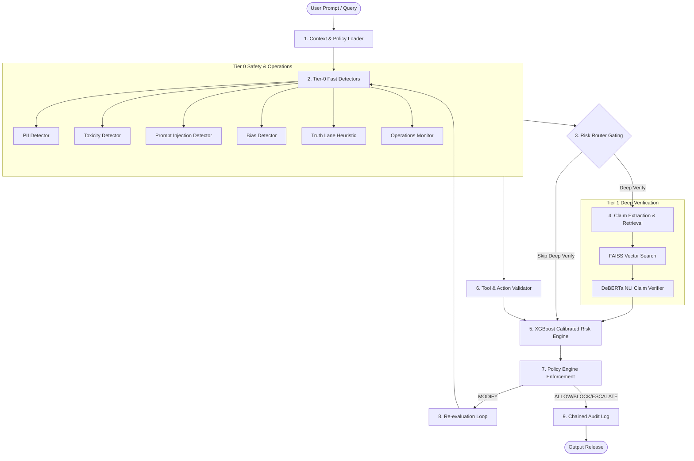

# ControlPlane.ai — Enterprise AI Safety, Risk Detection & Policy Enforcement Platform

> [!WARNING]
> This codebase represents a governance, policy enforcement, and risk-triage **prototype** for evaluation. It is not approved for production use without domain-specific validation, model calibration on real traffic, and comprehensive threat-modeling.

---

## 1. System Scope & Architecture

ControlPlane.ai is a model-agnostic safety gateway placed between enterprise AI applications and downstream LLM responses. It enforces policy thresholds and performs fact-checking using a staged pipeline:

1. **Context & Policy Loader**: Binds Application ID and resolves the active versioned YAML policy.
2. **Tier-0 Responsibility & Operations Detectors**:
   - **PII Detector**: Token classification (`iiiorg/piiranha-v1-detect-personal-information`) with entity spans.
   - **Toxicity / Safety**: Multi-label classifier (`unitary/toxic-bert`).
   - **Prompt Injection**: Evaluates prompt, retrieved document context, and tool arguments (`protectai/deberta-v3-base-prompt-injection-v2`).
   - **Bias Classifier**: DistilBERT model trained on legitimate context vs discriminatory proxy reasoning.
   - **Truth Lane Heuristic**: Fast indicator of hallucination risk based on claim characteristics.
   - **Operations monitor**: Analyzes rolling baseline token counts, latency, and costs to flag loop anomalies.
3. **Risk Router Gating**: Decides if Tier-1 Deep Verification is skipped, routed, or short-circuited (on hard ceiling hits).
4. **Tier-1 Deep Verification**:
   - **Claim Extraction**: Deterministic fact-sentence splitting.
   - **Grounding Passage Retrieval**: Embedding queries using `BAAI/bge-base-en-v1.5` and searching a local FAISS document store.
   - **DeBERTa Verifier**: Cross-encoder NLI model evaluating entailment, neutral, and contradiction verdicts.
5. **Calibrated Risk Engine**: Combines 16 signals in an XGBoost feature vector to yield a Platt/Sigmoid calibrated probability score.
6. **Policy Engine & Actions**: Maps risk thresholds to ALLOW, MODIFY (PII redacted), ESCALATE, or BLOCK actions.
7. **Tamper-Evident Chained Audit Log**: Append-only log signed with SHA-256 hashes chained to the previous record.

### Staged Pipeline Architecture Flowchart



---

## 2. Quick-Start Setup

### Environment Prerequisites
- Python 3.10+
- Recommended: Visual Studio Build Tools (for FAISS compilation on Windows)

### Installation
```bash
# 1. Environment
python -m venv .venv
# On Windows:
.venv\Scripts\activate
# On Linux/macOS:
source .venv/bin/activate

# Install dependencies
pip install -r requirements.txt
```

### Configuration (`.env`)
By default, the platform runs in offline **Mock Mode** (`MOCK_ML=true` in `.env`) using rule-based/regex models. This enables instant API response and zero download delays.
To enable real Hugging Face deep learning inference:
1. Set `MOCK_ML=false` in `.env`.
2. Run model cache downloads.

---

## 3. Command Executions

### Step 1: Download & Verify Models
Pre-cache Hugging Face checkpoints to the local cache:
```bash
python scripts/download_models.py
```

### Step 2: Prepare Datasets
Download and normalize public NLI datasets (FEVER, VitaminC, HoVer, AVeriTeC) into a common schema:
```bash
python training/scripts/prepare_datasets.py
```

### Step 3: Generate Synthetic Data
Generate synthetic enterprise facts, claims, and decision-context bias examples:
```bash
python training/generate_synthetic.py
```

### Step 4: Fine-Tune Classifiers (Optional)
Fine-tune custom task heads for Bias and NLI verification:
```bash
# Train bias detector
python training/train_bias.py --config training/configs/bias.yaml

# Train claim verifier
python training/train_verifier.py --config training/configs/verifier.yaml
```

### Step 5: Train & Calibrate Risk Engine
Extract out-of-fold detector outputs and fit the calibrated XGBoost/LR risk engine:
```bash
# Trains model and generates app/engine/risk_calibrator.joblib
python training/train_risk_engine.py --config training/configs/risk_engine.yaml

# Calibrate probabilities explicitly
python training/calibrate.py --model app/engine/risk_calibrator.joblib
```

### Step 6: Build FAISS Vector Index
Chunk and embed enterprise documents:
```bash
python scripts/build_index.py --input data/demo_docs
```

### Step 7: Run Automated Tests
```bash
pytest -v
```

### Step 8: Run Terminal Platform Demo
Runs interactive test scenarios showcasing ALLOW, MODIFY, ESCALATE, and BLOCK:
```bash
python scripts/run_demo.py
```

### Step 9: Run API Service
```bash
python -m app.main
```

---

## 4. Model Registry & Licensing

| Model Task | Hugging Face ID / Checkpoint | License |
|---|---|---|
| **PII Detector** | `iiiorg/piiranha-v1-detect-personal-information` | CC-BY-NC-ND-4.0 |
| **Toxicity Safety** | `unitary/toxic-bert` | Apache-2.0 |
| **Prompt Injection** | `protectai/deberta-v3-base-prompt-injection-v2` | Apache-2.0 |
| **Bias Detector** | `distilbert-base-uncased` (fine-tuned) | Apache-2.0 |
| **Claim Verifier** | `MoritzLaurer/DeBERTa-v3-large-mnli-fever-anli-ling-wanli` | MIT |
| **Embeddings** | `BAAI/bge-base-en-v1.5` | MIT |

> [!CAUTION]
> **Licensing Warning**: The PII model `piiranha-v1` utilizes the `CC-BY-NC-ND-4.0` license which restricts commercial production use. Organizations must conduct a legal review or swap this component for Presidio or custom-trained variants in commercial deployments.

---

## 5. Known Limitations

- **Evidence-Relative Truth**: NLI claim verifiers check text consistency relative to the retrieved corpus; they cannot prove absolute external facts. If the knowledge corpus is stale, verification may support false statements.
- **Classifier Constraints**: Prompt-injection classifiers are statistical predictors and can be bypassed by sophisticated, stateful jailbreak techniques.
- **PII Recall**: Regex/model hybrid detection may miss obfuscated or non-standard variable-length PII (e.g. customized user IDs). Layered rules must be customized for high-security environments.
- **Bias Contextuality**: Context bias classification is highly domain-dependent and should never replace formal regulatory compliance review.
